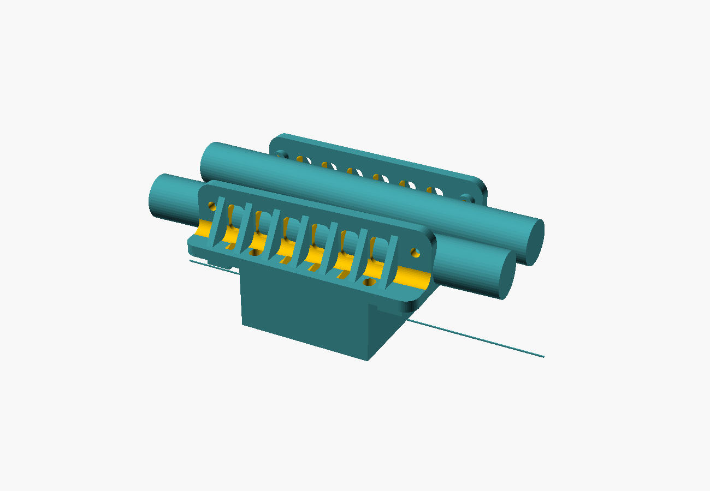
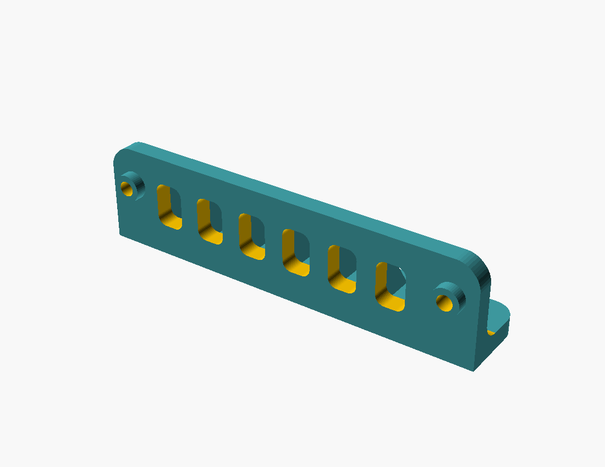

# FarDriver ND72450 under-seat mount — Ride1Up REVV1 FS

A pair of printed brackets that carry a **FarDriver ND72450** controller under the seat of a
**Ride1Up REVV1 FS**, bolting to the frame's existing rail lugs. No frame modification, no drilling,
no welding.

**Printed and in service.**

<p align="center">
  
</p>

The controller sits centred across the bike, spanning both rails and bolted to both brackets. Each
bracket carries roughly half the weight close in to its own rail, and the load is carried mostly in
**shear** rather than as a moment.

---

## What you get

| Part | Size | |
|---|---|---|
| `bracket_left` | 215 × 50.3 × 55 mm | one per rail |
| `bracket_right` | 215 × 50.3 × 55 mm | ⚠️ **a mirror image, not the same part again** |
| `brackets_plate` | 215 × 118 × 50.3 mm | both, laid down on one plate |
| `gauge` | 219.5 × 44 × 4 mm | print this **first** — see below |

<p align="center">
  
</p>

---

## ⚠️ Read this before you print anything

These four are load-bearing. The bracket carries a **2.15 kg** controller over rough ground.

1. **ASA, PC, PETG-CF or PA-CF. NEVER PLA.** PLA creeps under sustained load and softens near 60 °C —
   which an under-seat cavity on a dark bike reaches in summer. This is not a preference.
2. **Metal compression limiters in every bolt hole**, so no bolt preload ever passes through plastic.
   M5 frame side, M6 controller side. **Never thread a bolt into the plastic** — a thread cut in ASA
   under a hanging load creeps and backs out.
3. **Print with the vertical panel flat on the bed**, shelf standing up.
4. **Proof-load it before you trust it.**

---

## Start here: print the fit gauge

The whole design hangs off one number — the **187 mm** spacing between the frame's two rail lugs. The
gauge is a thin plate with both holes and a tick scale. It costs a few grams and settles the question
on your own frame.

```bash
openscad -o stl/gauge.stl -D 'part="gauge"' src/fardriver-underseat-mount.scad
```

The gauge should slide over both lugs without force. If it feels tight on your frame, open **one**
hole with a 6 mm drill rather than reprinting — but only one, or the fore/aft datum starts to float.

⚠️ Lug spacing is measured on one frame. Frame dimensions vary between production runs, so confirm it
on yours before printing a 215 mm part.

---

## Documentation

| | |
|---|---|
| **[docs/geometry.md](docs/geometry.md)** | Frame rails, controller hole pattern, and every dimension the model uses |
| **[docs/design-notes.md](docs/design-notes.md)** | The design constraints, and what each one protects |
| **[docs/printing.md](docs/printing.md)** | Material, orientation, settings |
| **[docs/assembly.md](docs/assembly.md)** | Hardware, limiters, bolt stacks, order, proof-loading |

## Layout

```
src/      fardriver-underseat-mount.scad  — the whole model, one file
stl/      pre-built exports
renders/  preview images
docs/     the four documents above
tools/    build.sh · check_stl.py
```

## Building from source

Needs [OpenSCAD](https://openscad.org/) (developed against 2021.01) and Python 3.

```bash
./tools/build.sh
```

Individual parts:

```bash
openscad -o out.stl -D 'part="bracket_left"' src/fardriver-underseat-mount.scad
```

Parts: `bracket_left` · `bracket_right` · `plate` · `gauge` · `panel` · `layout` · `mock` · `section`
· `rig` · `jig_spine` · `jig_spine_pair` · `jig_carrier`.

The jigs and the rig are measuring aids used to derive the frame geometry in the first place. You do
not need them to print the mount, but they are there if you are adapting this to another frame.

---

## Adapting it to a different frame or controller

The model is parametric. The numbers you would change first:

```openscad
lug_spacing   = 187;   // between your frame's rail lug centres
lug_od        = 16;    // lug outside diameter
lug_standoff  = 6;     // ⚠ nothing bolts FLAT to this frame — see design notes
ctrl_hole_dx  = 106;   // controller hole pattern, ALONG the bike
ctrl_hole_dy  = 168;   // ACROSS the bike
drop          = 35;    // how far the controller hangs below the lug line
```

⚠️ **`ctrl_hole_dx` / `dy` are the trap.** On this build the controller's **long axis runs across the
bike**, so the pair of holes landing on any one bracket is the **106 mm** pair, not the 168 mm pair.
Get that backwards and the bracket is 60 mm too short in the wrong direction.

---

## Contributing

Issues and pull requests welcome — especially **lug-spacing measurements from other REVV1 FS frames**
and **photos of it fitted**. See [CONTRIBUTING.md](CONTRIBUTING.md).

## Licence

[CC BY-SA 4.0](LICENSE). Print it, modify it, sell prints of it — credit the source and share your
changes under the same terms.

## Disclaimer

This hangs 2.15 kg of controller under the seat of a moving vehicle, at 5 kW, over rough ground.
Nothing here has been tested to any standard. **Proof-load it, use the metal limiters, and re-check
every fastener after the first ride.** You are responsible for what you bolt to your own bike.
